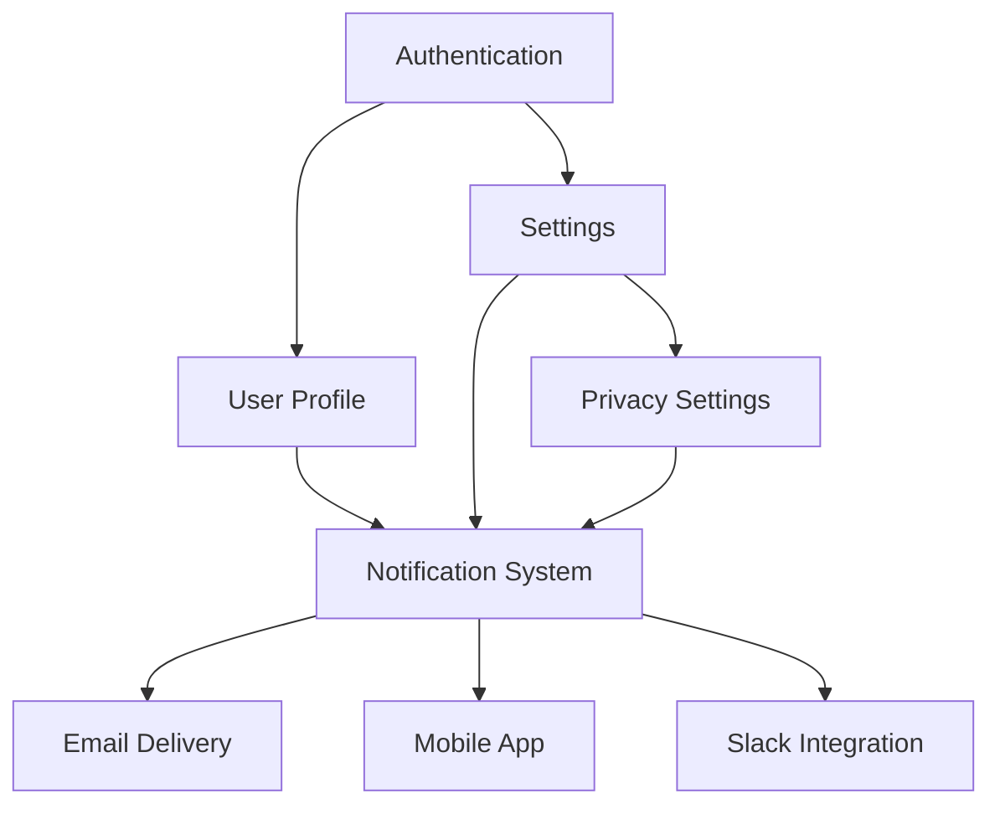

# claude-code# Smart Documentation Generator with Auto-Screenshots

## Single Command Usage

```bash
claude code "Generate complete documentation with screenshots for the [FEATURE-NAME] feature"
```

Claude Code will:

1. 🔍 **Detect** feature type (frontend/backend/full-stack)
1. 📝 **Generate** appropriate documentation
1. 📸 **Capture** screenshots automatically
1. 🖼️ **Insert** images directly into user docs

-----

## How Auto-Screenshot Works

### For Frontend Features

**Automatic Screenshot Capture:**

1. **Claude launches your app** in a headless browser
1. **Navigates to the feature** following the user flow
1. **Captures screenshots** at each important step
1. **Annotates images** with highlights/arrows
1. **Saves to** `docs/screenshots/`
1. **Embeds in** user documentation

### Screenshot Strategy

```
Feature: User Profile Edit
↓
Claude detects: src/pages/UserProfile.tsx
↓
Auto-captures:
1. Profile page initial view
2. Edit button hover state
3. Edit form opened
4. Form with sample data
5. Save button highlighted
6. Success message
↓
Inserts into docs/user/how-to-user-profile.md
```

-----

## Setup for Auto-Screenshots

### Prerequisites

```bash
# Install Playwright for screenshot automation
npm install -D @playwright/test

# Or if using Python
pip install playwright
playwright install chromium
```

### Configuration File

Create `.claude-docs.json` in your project root:

```json
{
  "screenshot": {
    "enabled": true,
    "baseUrl": "http://localhost:3000",
    "auth": {
      "type": "cookie",
      "credentials": {
        "username": "demo@example.com",
        "password": "demo123"
      }
    },
    "viewport": {
      "width": 1920,
      "height": 1080
    },
    "theme": "light",
    "waitForSelector": true,
    "highlightElements": true,
    "annotationColor": "#FF0000"
  },
  "paths": {
    "screenshots": "docs/screenshots",
    "userDocs": "docs/user",
    "devDocs": "docs/dev"
  }
}
```

-----

## Usage Examples

### Example 1: Frontend with Auto-Screenshots

```bash
# Start your dev server first
npm run dev

# Generate docs with screenshots
claude code "Generate documentation with screenshots for the notification-bell feature"
```

**Claude does:**

1. Reads component code at `src/components/NotificationBell/`
1. Launches browser at `http://localhost:3000`
1. Finds the notification bell component
1. Captures states: empty, with notifications, dropdown open, mark as read
1. Generates annotated screenshots
1. Creates user guide with embedded images

**Result:**

```markdown
## How to View Notifications

### Step 1: Click the Notification Bell

Click the bell icon (🔔) in the top-right corner.


*The notification bell is located in the header next to your profile icon*

### Step 2: View Your Notifications

A dropdown will appear showing your recent notifications.


*Your notifications appear in reverse chronological order*
```

-----

### Example 2: Multi-Page Flow

```bash
claude code "Generate documentation with screenshots for the checkout-process feature"
```

**Claude captures:**

1. Cart review page
1. Shipping information form
1. Payment details form
1. Order confirmation
1. Each error state

**Auto-generates:**

- 15+ screenshots covering full flow
- Annotated with red boxes and arrows
- Embedded in step-by-step guide

-----

### Example 3: Interactive Elements

```bash
claude code "Generate documentation with screenshots for the data-table feature"
```

**Claude captures:**

1. Table default state
1. Sorting by column (with sort icon highlighted)
1. Filtering active
1. Pagination controls
1. Row selection
1. Bulk actions menu
1. Export dropdown

**Creates:**

- Animated GIFs for interactions (optional)
- Before/after comparison screenshots
- Hover states and tooltips

-----

## Screenshot Annotation Features

### Automatic Highlights

Claude automatically adds:

**Red boxes** around important UI elements:

```
[Save Button] ← Red box outline
```

**Arrows** pointing to click targets:

```
→ Click here ← Red arrow
```

**Numbers** for sequential steps:

```
① First click
② Then click here
③ Finally click
```

**Tooltips** for context:

```
Callout bubble: "This button saves your changes"
```

-----

## Advanced Screenshot Options

### Capture Specific States

```bash
# Capture error states
claude code "Generate docs with error state screenshots for the login feature"

# Capture dark mode
claude code "Generate docs with dark mode screenshots for the dashboard feature"

# Capture mobile view
claude code "Generate docs with mobile screenshots for the navigation feature"
```

### Custom Screenshot Commands

Add to prompt for specific captures:

```bash
claude code "Generate docs for user-profile with screenshots showing:
- Profile in view mode
- Edit mode with form
- Avatar upload dialog
- Success message after save
- Mobile responsive view"
```

-----

## Screenshot Automation Script

Claude generates this helper script: `scripts/capture-screenshots.js`

```javascript
const { chromium } = require('playwright');
const fs = require('fs');
const path = require('path');

async function captureFeatureScreenshots(feature, steps) {
  const browser = await chromium.launch({ headless: true });
  const page = await browser.newPage({
    viewport: { width: 1920, height: 1080 }
  });

  // Login if required
  if (config.auth) {
    await login(page, config.auth);
  }

  const screenshots = [];

  for (const [index, step] of steps.entries()) {
    // Navigate to step
    await page.goto(step.url);
    
    // Wait for element
    if (step.waitFor) {
      await page.waitForSelector(step.waitFor);
    }
    
    // Highlight element if specified
    if (step.highlight) {
      await highlightElement(page, step.highlight);
    }
    
    // Capture screenshot
    const filename = `${feature}-step-${index + 1}-${step.name}.png`;
    const filepath = path.join('docs/screenshots', filename);
    
    await page.screenshot({
      path: filepath,
      fullPage: step.fullPage || false
    });
    
    screenshots.push({
      filename,
      filepath,
      description: step.description
    });
    
    // Perform action if specified (for next step)
    if (step.action) {
      await performAction(page, step.action);
    }
  }

  await browser.close();
  return screenshots;
}

async function highlightElement(page, selector) {
  await page.evaluate((sel) => {
    const element = document.querySelector(sel);
    if (element) {
      element.style.outline = '3px solid #FF0000';
      element.style.outlineOffset = '2px';
      element.scrollIntoView({ behavior: 'smooth', block: 'center' });
    }
  }, selector);
  
  await page.waitForTimeout(500); // Let animation complete
}

async function performAction(page, action) {
  switch (action.type) {
    case 'click':
      await page.click(action.selector);
      break;
    case 'hover':
      await page.hover(action.selector);
      break;
    case 'fill':
      await page.fill(action.selector, action.value);
      break;
    case 'select':
      await page.selectOption(action.selector, action.value);
      break;
  }
  
  await page.waitForTimeout(300);
}

module.exports = { captureFeatureScreenshots };
```

-----

## Screenshot Configuration Per Feature

Claude auto-generates: `docs/screenshots/[feature]-config.json`

```json
{
  "feature": "notification-bell",
  "steps": [
    {
      "name": "bell-location",
      "url": "/dashboard",
      "waitFor": "[data-testid='notification-bell']",
      "highlight": "[data-testid='notification-bell']",
      "description": "Notification bell in header",
      "fullPage": false
    },
    {
      "name": "dropdown-open",
      "url": "/dashboard",
      "waitFor": "[data-testid='notification-bell']",
      "action": {
        "type": "click",
        "selector": "[data-testid='notification-bell']"
      },
      "highlight": ".notification-dropdown",
      "description": "Dropdown showing notifications",
      "fullPage": false
    },
    {
      "name": "notification-item",
      "highlight": ".notification-item:first-child",
      "description": "Individual notification item"
    },
    {
      "name": "mark-read",
      "action": {
        "type": "hover",
        "selector": ".notification-item:first-child"
      },
      "highlight": ".mark-read-button",
      "description": "Mark as read button"
    }
  ]
}
```

-----

## Fallback: Manual Screenshot Mode

If auto-capture isn’t possible:

```bash
claude code "Generate documentation for the admin-panel feature (manual screenshots)"
```

**Claude generates:**

- Documentation with placeholder markers
- Screenshot checklist
- Detailed instructions for manual capture

```markdown
## Manual Screenshot Instructions

### 1. notification-bell-location.png
**What to show:** The notification bell icon in the header
**How to capture:**
1. Navigate to /dashboard
2. Wait for page to fully load
3. Use browser dev tools to highlight the bell icon
4. Take screenshot with annotation tool
5. Save as `notification-bell-location.png`

📸 **Placeholder:** Screenshot will appear here once captured

### 2. notification-dropdown-open.png
**What to show:** Dropdown menu with notifications visible
**How to capture:**
1. Click the notification bell
2. Wait for dropdown animation
3. Capture the full dropdown
4. Save as `notification-dropdown-open.png`

📸 **Placeholder:** Screenshot will appear here once captured
```

-----

## Screenshot Best Practices

Claude follows these guidelines:

### ✅ DO:

- **Highlight interactive elements** (buttons, links, inputs)
- **Show cursor** when indicating where to click
- **Capture loading/success states** for feedback
- **Include enough context** to orient users
- **Use consistent viewport** size (1920x1080 default)
- **Clean test data** - no personal info, realistic examples
- **Show error states** when relevant

### ❌ DON’T:

- **Include sensitive data** (real emails, passwords, PII)
- **Use production data** in screenshots
- **Capture during animations** (wait for completion)
- **Show outdated UI** (regenerate when design changes)
- **Forget dark mode** (capture both if supported)

-----

## Regenerating Screenshots

### Update All Screenshots

```bash
claude code "Regenerate all screenshots for the user-profile feature"
```

### Update Specific Screenshot

```bash
claude code "Regenerate the edit-form screenshot for user-profile"
```

### Batch Regeneration

```bash
claude code "Regenerate screenshots for all features in src/components/"
```

-----

## Screenshot Optimization

Claude automatically:

1. **Compresses images** using pngquant
1. **Generates thumbnails** for galleries
1. **Creates WebP versions** for modern browsers
1. **Adds alt text** for accessibility
1. **Lazy loads** images in documentation

```markdown

<!-- Auto-generated optimized versions:
- notification-bell-location.webp (modern browsers)
- notification-bell-location-thumb.png (thumbnail)
- Alt text: Screenshot showing the notification bell icon in the header
-->
```

-----

## Animated Screenshots (GIFs)

For interactive features, Claude can capture GIFs:

```bash
claude code "Generate docs with animated screenshots for the drag-and-drop feature"
```

**Creates:**

- Animated GIF showing drag interaction
- Individual frames as static images
- Both embedded in documentation

```markdown
## Reordering Items

Click and drag any item to reorder the list.


*Click and hold an item, then drag to the desired position*
```

-----

## Multi-Device Screenshots

### Responsive Views

```bash
claude code "Generate docs with mobile and desktop screenshots for the navigation feature"
```

**Captures:**

- Desktop (1920x1080)
- Tablet (768x1024)
- Mobile (375x812)

**Documentation shows:**

```markdown
### On Desktop


### On Mobile

*Note: Mobile menu uses a hamburger icon*
```

-----

## Screenshot Testing Integration

### Visual Regression Tests

Claude also generates Playwright visual regression tests:

```javascript
// tests/visual/notification-bell.spec.js
test('notification bell matches baseline', async ({ page }) => {
  await page.goto('/dashboard');
  await page.waitForSelector('[data-testid="notification-bell"]');
  
  // Capture and compare
  await expect(page).toHaveScreenshot('notification-bell-baseline.png');
});

test('notification dropdown matches baseline', async ({ page }) => {
  await page.goto('/dashboard');
  await page.click('[data-testid="notification-bell"]');
  await page.waitForSelector('.notification-dropdown');
  
  await expect(page).toHaveScreenshot('notification-dropdown-baseline.png');
});
```

Run these tests to detect UI changes:

```bash
npm run test:visual
```

-----

## Complete Example Output

**Command:**

```bash
claude code "Generate documentation with screenshots for the password-reset feature"
```

**Generated Files:**

```
docs/
├── dev/
│   └── password-reset-implementation.md
├── user/
│   └── how-to-password-reset.md (with embedded screenshots)
├── screenshots/
│   ├── password-reset-config.json (automation config)
│   ├── password-reset-step-1-forgot-link.png
│   ├── password-reset-step-2-email-form.png
│   ├── password-reset-step-3-success-message.png
│   ├── password-reset-step-4-email-received.png
│   ├── password-reset-step-5-reset-form.png
│   ├── password-reset-step-6-password-updated.png
│   └── README.md (screenshot metadata)
└── scripts/
    └── capture-password-reset-screenshots.js
```

**User Documentation Preview:**

```markdown
# How to Reset Your Password

## Step 1: Click "Forgot Password?"

On the login page, click the "Forgot Password?" link below the password field.


*The "Forgot Password?" link is located below the login form*

## Step 2: Enter Your Email

Type the email address associated with your account and click "Send Reset Link".


*Enter your email and click the blue "Send Reset Link" button*

## Step 3: Check Your Email

You'll see a confirmation message. Check your email inbox.


*Success message confirming the email was sent*

[Continues with all steps fully illustrated...]
```

-----

## Quick Reference

|Command   |What It Does                                                          |
|----------|----------------------------------------------------------------------|
|Basic     |`claude code "Generate docs with screenshots for [feature]"`          |
|Mobile    |`claude code "Generate docs with mobile screenshots for [feature]"`   |
|Dark Mode |`claude code "Generate docs with dark mode screenshots for [feature]"`|
|Animated  |`claude code "Generate docs with animated screenshots for [feature]"` |
|Manual    |`claude code "Generate docs for [feature] (manual screenshots)"`      |
|Regenerate|`claude code "Regenerate screenshots for [feature]"`                  |

-----

## Auto-Linking to Related Documentation

### Intelligent Link Detection

Claude automatically scans your existing documentation and:

1. 🔍 **Finds related topics** by analyzing content
1. 🔗 **Inserts relevant links** throughout the new docs
1. 📚 **Updates existing docs** to reference the new feature
1. 🗺️ **Maintains a documentation map** showing relationships

-----

## How Auto-Linking Works

### Step 1: Documentation Scan

When generating docs, Claude:

```bash
claude code "Generate documentation with screenshots for the notification-system feature"
```

**Claude automatically:**

1. Scans all files in `docs/` directory
1. Analyzes existing documentation content
1. Identifies related features and concepts
1. Maps relationships between features

**Example Detection:**

```
New: notification-system
↓
Scans existing docs:
- user-profile.md (mentions notifications)
- settings.md (notification preferences)
- email-delivery.md (notification channels)
- authentication.md (user context)
↓
Creates relationship map:
- Strong relation: settings (notification prefs)
- Medium relation: user-profile (user context)
- Weak relation: email-delivery (delivery method)
```

-----

### Step 2: Smart Link Insertion

Claude inserts contextual links throughout the new documentation:

**Generated User Documentation:**

```markdown
# How to Use the Notification System

The notification system alerts you about important events in your account.

> 💡 **Related:** Learn how to [customize your notification preferences](./how-to-settings.md#notification-preferences) in Settings.

## Getting Started

Before using notifications, make sure you're [logged into your account](./how-to-authentication.md).

[Content continues...]

## Notification Channels

You can receive notifications through:
- In-app alerts
- Email notifications (see [Email Delivery Setup](./how-to-email-delivery.md))
- Push notifications (requires [mobile app setup](./how-to-mobile-app.md))

## Related Features

This feature works with:
- [User Profile Settings](./how-to-user-profile.md) - Update your notification email
- [Privacy Settings](./how-to-privacy.md) - Control who can notify you
- [Mobile App](./how-to-mobile-app.md) - Receive push notifications

## See Also

**For Developers:**
- [Notification System API Reference](../dev/notification-system-implementation.md#api-reference)
- [WebSocket Integration](../dev/websocket-integration.md)
- [Email Template Development](../dev/email-templates.md)

**For Users:**
- [Managing Your Inbox](./how-to-inbox.md)
- [Blocking Unwanted Notifications](./how-to-privacy.md#blocking)
```

-----

### Step 3: Bidirectional Linking

Claude also **updates existing documentation** to reference the new feature:

**Existing: `docs/user/how-to-settings.md`**

Before:

```markdown
## Notification Preferences

Configure how you receive notifications...
```

After (auto-updated):

```markdown
## Notification Preferences

Configure how you receive notifications...

> 🆕 **New Feature:** Check out the complete [Notification System Guide](./how-to-notification-system.md) for detailed information about managing all your notifications.

[Rest of content...]
```

**Existing: `docs/dev/user-profile-implementation.md`**

Gets updated with:

```markdown
## Related APIs

This feature integrates with:
- [Authentication API](./authentication-implementation.md)
- [Notification System API](./notification-system-implementation.md) 🆕
- [Email Service API](./email-service-implementation.md)
```

-----

## Link Types Auto-Generated

### 1. **Prerequisite Links**

Links to features users need first:

```markdown
## Before You Begin

Make sure you have:
- [Created an account](./how-to-signup.md)
- [Verified your email](./how-to-email-verification.md)
- [Set up two-factor authentication](./how-to-2fa.md) (recommended)
```

### 2. **Related Feature Links**

Links to complementary features:

```markdown
## Related Features

- [Message Filters](./how-to-message-filters.md) - Control which notifications you receive
- [Quiet Hours](./how-to-quiet-hours.md) - Schedule when to receive notifications
- [Priority Inbox](./how-to-priority-inbox.md) - Organize important notifications
```

### 3. **Integration Links**

Links to features that work together:

```markdown
## Integrations

This feature works seamlessly with:
- [Slack Integration](./how-to-slack-integration.md) - Receive notifications in Slack
- [Calendar Sync](./how-to-calendar-sync.md) - Get calendar event notifications
- [Email Forwarding](./how-to-email-forwarding.md) - Forward notifications to email
```

### 4. **Troubleshooting Links**

Links to related troubleshooting:

```markdown
## Troubleshooting

**Not receiving notifications?**
- Check your [notification preferences](./how-to-settings.md#notifications)
- Verify [email delivery settings](./troubleshooting-email.md)
- Review [browser notification permissions](./troubleshooting-browser-permissions.md)
```

### 5. **Developer Reference Links**

Cross-references between user and developer docs:

```markdown
## For Developers

Technical documentation:
- [Notification API Reference](../dev/notification-system-implementation.md#api-reference)
- [WebSocket Events](../dev/websocket-events.md)
- [Push Notification Setup](../dev/push-notification-setup.md)
```

-----

## Documentation Map Generation

Claude creates a visual documentation map: `docs/DOCUMENTATION_MAP.md`

```markdown
# Documentation Map

Last Updated: 2025-10-28

## Feature Relationships



## Documentation Index

### Core Features

- [Authentication](./user/how-to-authentication.md)
  - Related: User Profile, Settings, Password Reset
- [User Profile](./user/how-to-user-profile.md)
  - Related: Settings, Notifications, Privacy
- [Notification System](./user/how-to-notification-system.md) 🆕
  - Related: Settings, Email, Mobile App, Slack

### Developer Documentation

- [Notification System API](./dev/notification-system-implementation.md) 🆕
  - Integrates with: User Profile API, Email Service, WebSocket
- [Authentication API](./dev/authentication-implementation.md)
  - Used by: Most features

## Recently Added

- 2025-10-28: [Notification System](./user/how-to-notification-system.md)
- 2025-10-25: [Two-Factor Authentication](./user/how-to-2fa.md)
- 2025-10-20: [Password Reset](./user/how-to-password-reset.md)

```
---

## Advanced Link Detection

### Semantic Analysis

Claude uses semantic understanding to find related content:

**Example:** New feature is "Dark Mode"

Claude detects relationships with:
- "Themes" (synonym)
- "Appearance Settings" (category)
- "Accessibility" (related concern)
- "User Preferences" (storage location)
- "Display Settings" (UI category)

**Inserts links like:**
```markdown
Dark mode is part of your [appearance settings](./how-to-appearance.md).

For more accessibility options, see [Accessibility Features](./how-to-accessibility.md).
```

-----

### API Relationship Mapping

For developer docs, Claude traces API dependencies:

**Example:** New “Payment Processing” API

```markdown
# Payment Processing API

## Dependencies

This API requires:
- [Authentication API](./authentication-implementation.md) - For user verification
- [User Service API](./user-service-implementation.md) - For user data
- [Email Service API](./email-service-implementation.md) - For receipts

## Used By

The following features use this API:
- [Checkout Process](./checkout-implementation.md)
- [Subscription Management](./subscription-implementation.md)
- [Invoice Generation](./invoice-implementation.md)

## Related Services

- [Refund Processing](./refund-processing-implementation.md)
- [Payment History](./payment-history-implementation.md)
- [Billing Dashboard](./billing-dashboard-implementation.md)
```

-----

## Link Maintenance

### Broken Link Detection

Claude automatically checks for:

- Broken links in new documentation
- Links that will break in existing docs
- Outdated references

**Generates:** `docs/LINK_CHECK_REPORT.md`

```markdown
# Documentation Link Check

Last Checked: 2025-10-28

## ✅ Valid Links (247)
All links properly resolve.

## ⚠️ Warnings (3)
- `how-to-notifications.md` references deprecated API in dev docs
  - Suggested: Update to reference `notification-system-implementation.md`

## ❌ Broken Links (0)
No broken links found.

## 🔄 Redirects Needed (2)
- Old: `how-to-email-settings.md`
- New: `how-to-notification-system.md#email-preferences`
- Action: Add redirect or update references
```

### Auto-Update on Refactoring

When docs are moved or renamed:

```bash
# Rename a feature's documentation
mv docs/user/how-to-old-name.md docs/user/how-to-new-name.md

# Update all references automatically
claude code "Update all documentation links to reflect new filename"
```

Claude:

1. Scans all documentation files
1. Finds references to old filename
1. Updates all links
1. Reports changes made

-----

## Configuration

### `.claude-docs.json` - Link Settings

```json
{
  "linking": {
    "enabled": true,
    "scanPaths": ["docs/", "README.md"],
    "excludePaths": ["docs/archive/", "docs/drafts/"],
    "relationshipStrength": {
      "strong": 0.8,
      "medium": 0.5,
      "weak": 0.3
    },
    "maxLinksPerSection": 5,
    "bidirectionalUpdates": true,
    "generateMap": true,
    "linkStyle": "relative",
    "addNewBadges": true,
    "checkBrokenLinks": true
  }
}
```

-----

## Link Organization Strategies

### Inline Contextual Links

Links within the content flow:

```markdown
To enable notifications, go to your [settings page](./how-to-settings.md) 
and toggle the notification switch.
```

### Callout Boxes

Highlighted related content:

```markdown
> 💡 **Tip:** You can customize which events trigger notifications in 
> [Notification Preferences](./how-to-settings.md#notification-preferences).
```

### Related Sections

Dedicated sections for related content:

```markdown
## Related Topics

### For Users
- [Managing Notifications](./how-to-notifications.md)
- [Email Preferences](./how-to-email-preferences.md)

### For Administrators
- [System-Wide Notification Settings](./admin/notification-settings.md)
- [Notification Templates](./admin/notification-templates.md)
```

### Navigation Breadcrumbs

Auto-generated breadcrumb trails:

```markdown
🏠 [Home](../README.md) > [User Guides](./README.md) > 
[Account Settings](./how-to-settings.md) > Notification System
```

-----

## Link Examples by Feature Type

### Frontend Component Links

```markdown
# Button Component

## Related Components
- [Icon Component](./icon-component.md) - Used inside buttons
- [Loading Spinner](./loading-spinner.md) - Button loading state
- [Form Component](./form-component.md) - Buttons in forms

## Design System
- [Color Tokens](../design/color-tokens.md)
- [Typography](../design/typography.md)
- [Spacing System](../design/spacing.md)
```

### Backend API Links

```markdown
# User API

## Related APIs
- [Authentication API](./authentication-api.md) - Required for all endpoints
- [Profile API](./profile-api.md) - Extended user information
- [Permissions API](./permissions-api.md) - User authorization

## Database
- [User Schema](../database/user-schema.md)
- [Migration Guide](../database/migrations.md)
```

### Full-Stack Feature Links

```markdown
# Shopping Cart

## Frontend
- [Cart Component](../components/cart-component.md)
- [Checkout Flow](../components/checkout-flow.md)

## Backend
- [Cart API](../api/cart-api.md)
- [Order Processing](../api/order-processing.md)

## Integration
- [Payment Gateway](../integrations/payment-gateway.md)
- [Inventory System](../integrations/inventory.md)
```

-----

## Link Density Control

Claude maintains optimal link density:

### ✅ Good Link Density

```markdown
The notification system [integrates with email](./email-delivery.md) 
to send alerts. You can [customize preferences](./settings.md#notifications) 
or [disable notifications](./settings.md#disable) entirely.
```

*3 links in 30 words = 10% link density (optimal)*

### ❌ Too Many Links

```markdown
The [notification](./notifications.md) [system](./system-overview.md) 
[integrates](./integrations.md) with [email](./email.md) to 
[send](./sending.md) [alerts](./alerts.md).
```

*6 links in 12 words = 50% link density (overwhelming)*

-----

## Usage Commands

### Generate with Auto-Linking

```bash
# Default: Auto-linking enabled
claude code "Generate documentation with screenshots for notification-system"
```

### Disable Auto-Linking

```bash
claude code "Generate documentation for notification-system without auto-linking"
```

### Link Analysis Only

```bash
# Analyze and suggest links without generating new docs
claude code "Analyze documentation links for notification-system"
```

### Update Existing Links

```bash
# Refresh links in existing documentation
claude code "Update all documentation links in docs/user/"
```

### Generate Documentation Map

```bash
# Create/update the documentation map
claude code "Generate documentation relationship map"
```

-----

## Link Quality Metrics

Claude tracks link quality in `docs/LINK_METRICS.md`:

```markdown
# Documentation Link Metrics

## Coverage
- Documents with 0 links: 2 (improve discoverability)
- Documents with 1-3 links: 15 ✅
- Documents with 4-7 links: 23 ✅
- Documents with 8+ links: 5 (consider splitting content)

## Link Health
- Valid internal links: 247 ✅
- Broken internal links: 0 ✅
- External links: 18
- External links checked: 18 ✅

## Relationship Strength
- Strong relationships: 34
- Medium relationships: 67
- Weak relationships: 12

## Most Referenced Documents
1. Authentication (referenced by 23 docs)
2. Settings (referenced by 19 docs)
3. User Profile (referenced by 15 docs)

## Orphaned Documents
Documents with no incoming links:
- docs/archive/old-feature.md (archived)
- docs/drafts/new-feature.md (draft)

## Recommendations
- Add links to orphaned documents or move to archive
- Consider splitting documents with 10+ outgoing links
- Review weak relationships for accuracy
```

-----

## Interactive Documentation Navigation

### Auto-Generated Table of Contents

Each document gets smart TOC with related links:

```markdown
# Notification System

## Table of Contents
- [Overview](#overview)
- [Getting Started](#getting-started) 
  - Prerequisites: [Authentication](./authentication.md), [Settings](./settings.md)
- [How It Works](#how-it-works)
- [Configuration](#configuration)
  - See also: [Email Setup](./email-delivery.md)
- [Troubleshooting](#troubleshooting)
  - Related: [Common Issues](./troubleshooting.md)

## Related Documentation
Quick access to related topics:
- 📱 [Mobile App Setup](./mobile-app.md)
- 🔔 [Notification Preferences](./settings.md#notifications)
- 📧 [Email Configuration](./email-delivery.md)
```

-----

**Auto-linking creates a connected documentation ecosystem - users always find what they need! 🔗✨**
